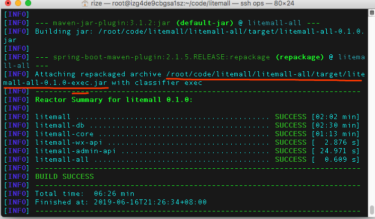
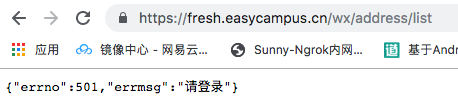

### Litemall 部署指南 第2章 - 编译并运行后端代码

> 之前我们安装了JDK、Maven就有了编译的条件。配置完成后即可编译。这章，我们将做到能从公网访问后端Api。本章操作均在CentOS7.4服务器上完成。

cd进去litemall代码目录后，执行mvn package命令。

	cd
	cd code/litemall
	man package

第一次打包时，maven会自动下载项目依赖的jar包，所以第一次用时比较长。编译完成后，命令提示窗中每个子项目编译完成。

编译完成后会生成可执行jar包。这就是我们需要的。若之前是按照 “文档” 存放的路径存放的，将会出现在/root/code/litemall/litemall-all/target/litemall-all-0.1.0-exec.jar中。

将此包移动到 /root/ 中， 并cd回到 /root/目录。使用java -jar 命令运行
	
	mv /root/code/litemall/litemall-all/target/litemall-all-0.1.0-exec.jar ~/.
	cd
	nohup java -jar litemall-all-0.1.0-exec.jar > /dev/null &

等待10秒左右，使用命令netstat来查看端口。若启动成功，项目会监听8080端口。

	[root@izg4de9cbgsa1sz ~]#  netstat -apn | grep 8080
	tcp        0      0 0.0.0.0:8080            0.0.0.0:*               LISTEN      1400/java

这就表示已经成功启动了。如果您的安全组和防火墙放通了8080端口，就能从公网访问到了。但是现在还不够，因为小程序要求必须使用HTTPS标准443端口才可以。下面我们就通过nginx来做一个反向代理，并将https的ssl证书配置到nginx上。

---

nginx配置https请参照 [CentOS 安装 Nginx 并配置 SSL](https://github.com/iotechn/document-basic/blob/master/CentOS_Install_Nginx_With_Https.md)

配置完SSL后，将location做如下配置

	location / {
		proxy_pass http://localhost:8080/;
	}

然后使用命令重新加载nginx

	service nginx restart

若不是用过yum安装的，可能需要用
	
	nginx -s reload

这样就proxy_pass 到之前的8080端口了。最后一步将域名解析到服务器IP上。

然后我们随便访问个小程序Api。PS：请注意放通443端口。

到此，后端服务全部部署完成，下面我们还差小程序和后台管理了！