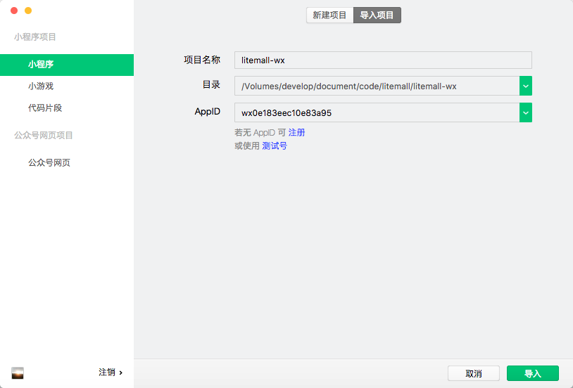
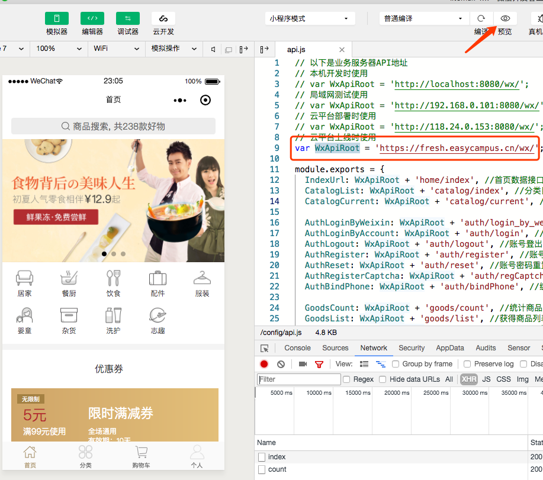

### Litemall 部署指南 第3章 - 小程序部署

> 本章讲解运行litemall小程序。操作将在PC上完成。

请下载 [微信开发者工具](https://developers.weixin.qq.com/miniprogram/dev/devtools/devtools.html)

开发小程序，是需要先在 微信公众平台 mp.weixin.qq.com 上注册小程序账号的，注册完成后，会分配相应的appid。前面在后端配置中已经用到，相信大家已经申请好了。

小程序已经没办法在服务器上配置了，所以请在本机上下载一份litemall的代码。
下载完成后使用 微信开发者工具 导入 litemall/litemall-wx 目录，将AppId换成自己的AppId。

导入成功后，将config/api.js 路径换成自己的 我这里是 https://fresh.easycampus.cn/wx/; 若现在还是无法显示出数据，是因为您的域名并没有配置到小程序的调用白名单。mp.weixin.qq.com后台操作路径， 左侧“开发”-开发设置-服务器域名，添加好后，再刷新，即可显示。

这时候再点预览，就可以在真机上运行了。到此小程序部署完成。点击右上角“上传”，并mp.weixin.qq.com后台“版本管理”提交申请，就可以申请上线了。

现在我们还差小程序后台部署了。

[第4章 VUE后台部署](https://github.com/iotechn/litemall-guide-doc/blob/master/Chapter-4.md)
