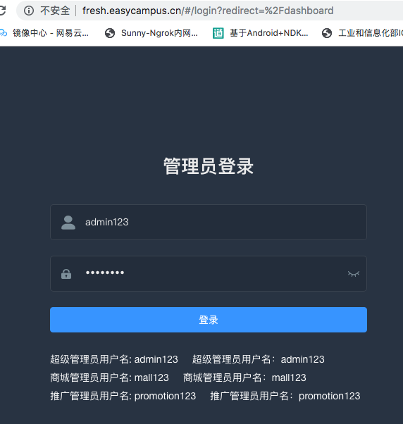

### Litemall 部署指南 第4章 - VUE后台部署

> 本章将讲解litemall vue后台部署。本章操作均在CentOS7.4服务器上完成。

Litemall的后台是使用vuejs编写的，并且使用elmentui快速构建库。

首先安装nodejs。请参照[CentOS 安装 NodeJs 8.15.0](https://github.com/iotechn/document-basic/blob/master/CentOS_Install_NodeJS_8.15.0.md)

这里我们使用cnpm来安装以来，请把cnpm也安装下吧。cd到代码目录
	
	cd
	cd code/litemall/litemall-admin/

先编辑下生产环境的配置

	vim config/prod.env.js
	
把BASE_API的 www.example.com 换成自己的域名即可。然后来安装依赖，也可以先安装依赖再配置。

	cnpm install

A few minutes later,安装完成，接下来可以编译了。

	cnpm run build:prod

编译完成后，看到Build complete，会生成dist文件夹。将dist文件夹扔进web容器就可以了。正好nginx可以作为web容器，那我们就直接把dist文件扔进nginx吧。

	rm -rf /usr/share/nginx/html/*
	cd dist
	mv * /usr/share/nginx/html/

之前我们并没有删除80端口的配置，这里可以直接用了。PS：请确认防火墙和安全组放通80端口。

	server {
        listen       80 default_server;
        listen       [::]:80 default_server;
        server_name  _;
        root         /usr/share/nginx/html;

        # Load configuration files for the default server block.
        include /etc/nginx/default.d/*.conf;

        location / {
        }

        error_page 404 /404.html;
            location = /40x.html {
        }

        error_page 500 502 503 504 /50x.html;
            location = /50x.html {
        }
    }

访问自己的域名，注意是使用http协议。

点击登录，能进去。ok后台部署也完成了。最后就是制作阿里云镜像了(镜像里面，已经把敏感信息删除)。

	

